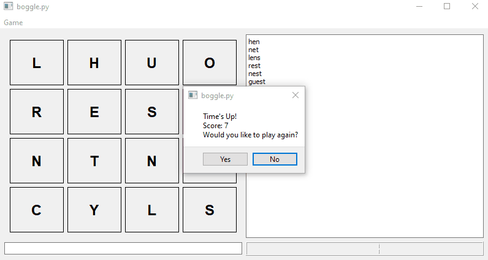

# Boggle

- Boggle written in Python
- Only requires two dependencies:
   - PyQt5
   - nltk

The problem with nltk is you must install the words dataset to check words.

```
import nltk
nltk.download('popular')
```

Then you can run the game.
```
pipenv install
pipenv run gui.py
```


